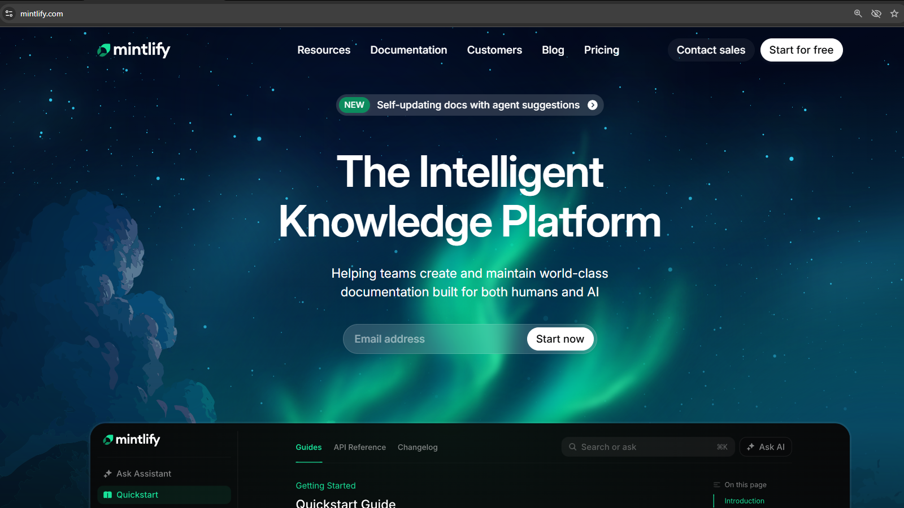

# Assignment-3: HTML & CSS

## Recreate a desktop-first documentation-style website inspired by the Mintlify website. This assignment focuses on content structure, readability and layout accuracy.

## Source URL: (https://mintlify.com)

##  Assignment Image for reference

# Solution -  Click [Here](https://dineshtanwar-mintlify-landingpage.netlify.app/) To View Live Page
### description
- proper HTML5 semantic tags are used
- Images & fonts are kept in Assets folder for proper structure
-  Inter Variable font is used in the project

### color used are:
- main-text-color: lab(100% 0 0);
- grey-text-color: lab(100% 0 0/0.7);
- dark-text-color: lab(2.42579% -0.165291 -0.470081);
- green-text-color: lab(79.9844% -59.6292 22.5096);

## Output Image screenshot for reference

### ----- end ------