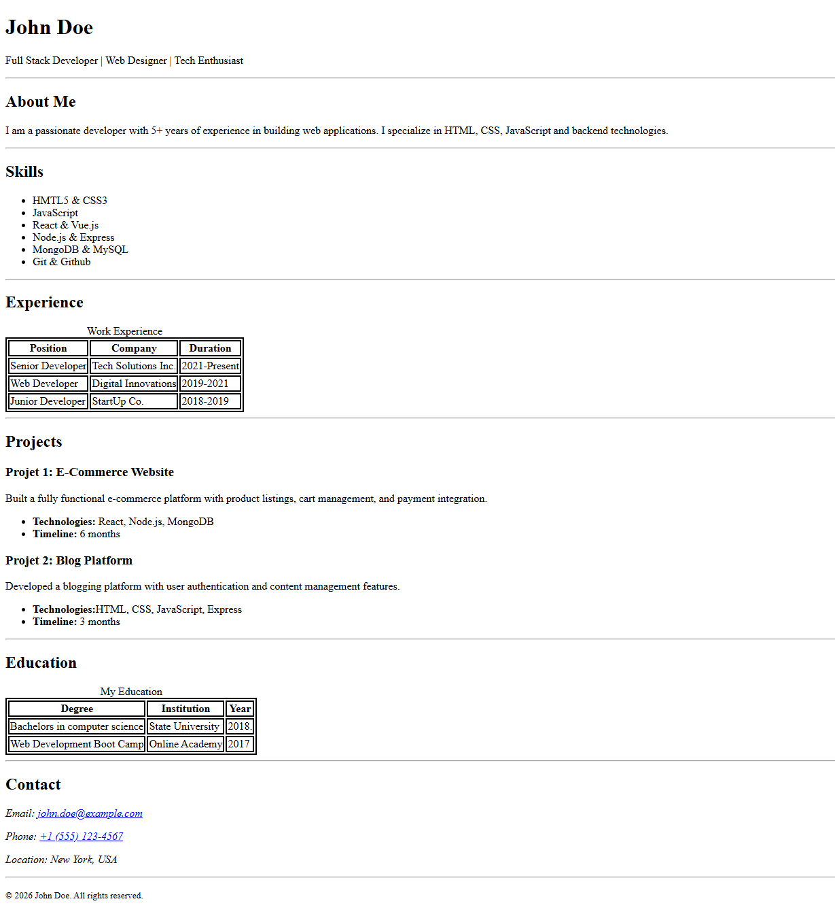

# Assignment-1: Build a single-page resume website in HTML that looks like the provided layout. This assignment doesn’t need any usage of CSS. The image below is just an example representation. It should include sections like header/name, about, skills list, experience table, projects, education table, and contact details. The final output can be showcased in various formats:

## Input Image

# Solution

## screenshot of output

