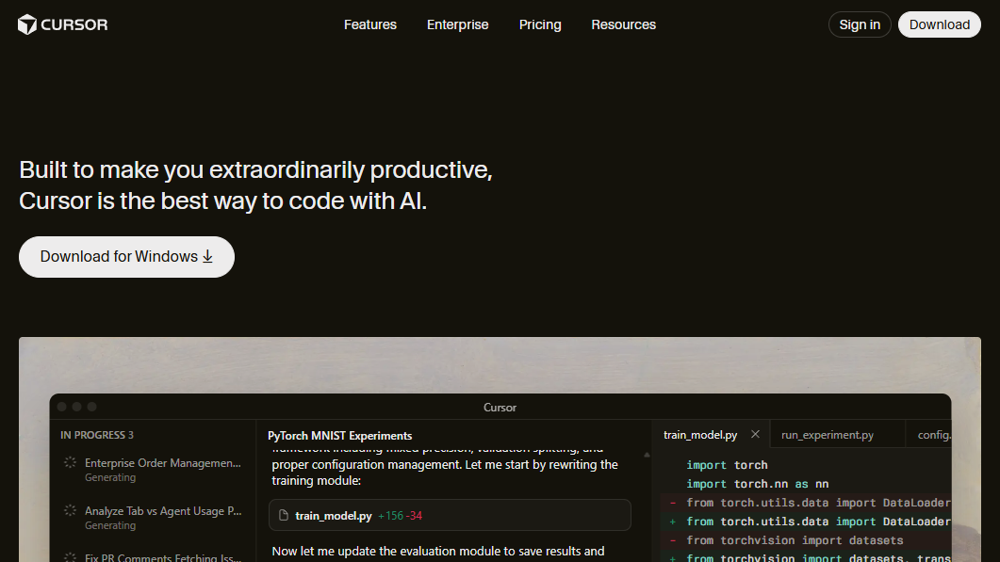
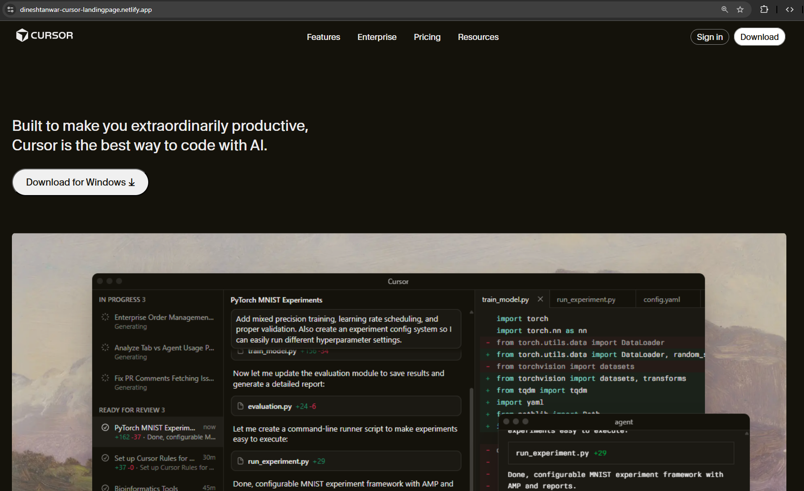

# Assignment-2: HTML & CSS

## Recreate a desktop-first developer tool landing page inspired by the Cursor website. The goal of this assignment is visual and structural accuracy, not creativity or interactivity.

## Source URL: (https://cursor.com)

##  Assignment Image for reference

# Solution -  Click [Here](https://dineshtanwar-cursor-landingpage.netlify.app/) To View Live Page
### description
- proper HTML5 semantic tags are used
- Images & fonts are kept in Assets folder for proper structure
- Gothic-Cursor font is used in the project

### color used are:

- --primary-color: #14120b;
- --secondary-color: #1b1913;
- --text-color: #edecec;
- --color-black: #14120b;

## Output Image screenshot for reference

### ----- end ------