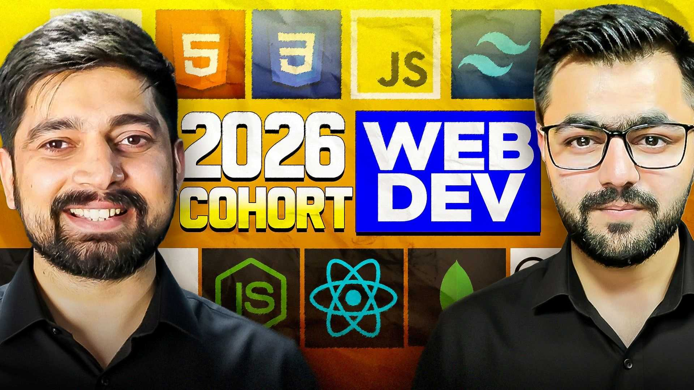

# Introduction

Hy, I'm Dinesh Tanwar from Rajasthan, India. 
[LinkedIn](https://www.linkedin.com/in/idinesh-tanwar/) 
[X](https://x.com/idineshtanwar)
[Hashnode](https://dineshtanwar.hashnode.dev/) 

This repository is my proof of learning from the Full Stack Web Development Cohort 2026 by [chaicode.com](chaicode.com).

Course Link: [https://courses.chaicode.com/learn/batch/Web-Dev-Cohort-2026](https://courses.chaicode.com/learn/batch/Web-Dev-Cohort-2026)

Teachers- [Hitesh Choudhary](https://hitesh.ai/) & [Piyush Garg](https://www.piyushgarg.dev/)

# Why This Repository Exist ?

- For showcasing my proof of work
- To track daily progress & learning
- To keep a structured documentation of complete journey
- To build consistency & discipline

# What It Contains ?

The repo contains 4 folders and 1 readme file

- assignments & real projects which were developed during the course.
- Technical articles which I wrote according to my research, knowledge, learnings & understanding.
- Public URL of technical articles is attached with respective file/folder.
- Assignments & Projects are mentioned with proper given problem statement & solution with public URL and Images for better understanding.

## thanks for reading 🙋‍♂️ by-by ✨